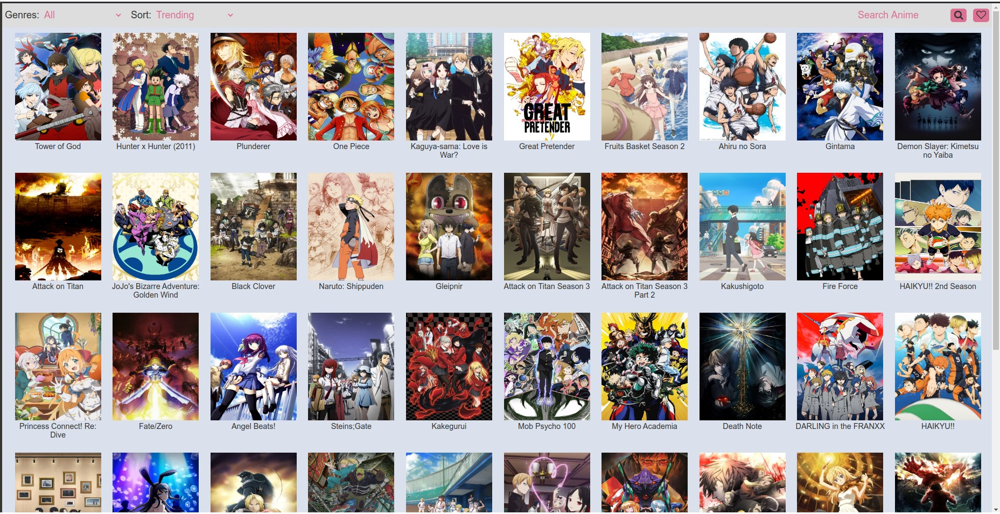
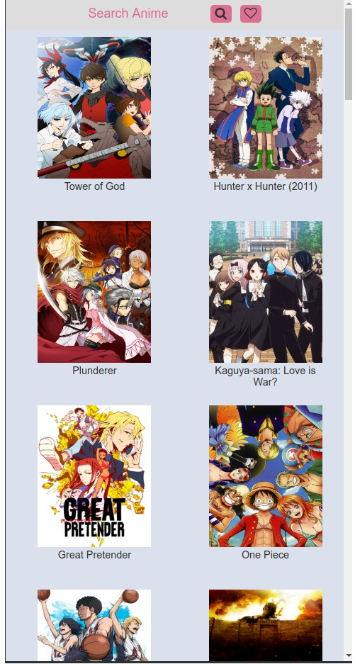
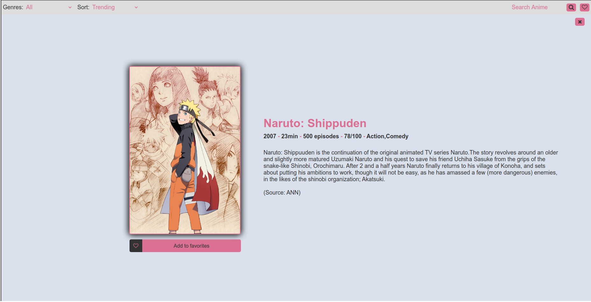
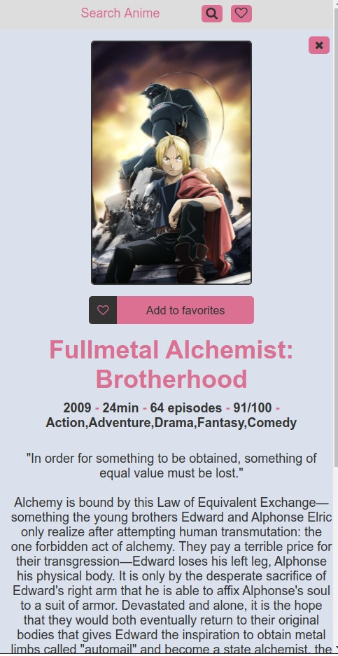

# Anime-List

Browse through a list of animes, filtering by genres or by popularity, and keep track of your favorites animes.

---

### Technologies used

_Vanilla JavaScript:_

1. used the Fetch API to make requests to the anime API(GraphQL), and worked with JSON to manipulate its response
1. used the localStorage to store the animes saved as favorites by the user

_HTML and CSS:_

1. used CSS Grid and CSS Flexbox to display the anime data on the screen
